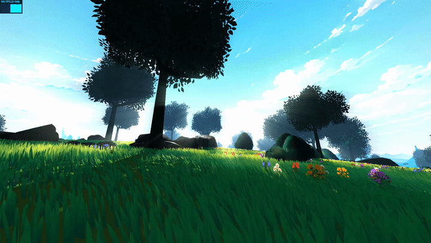
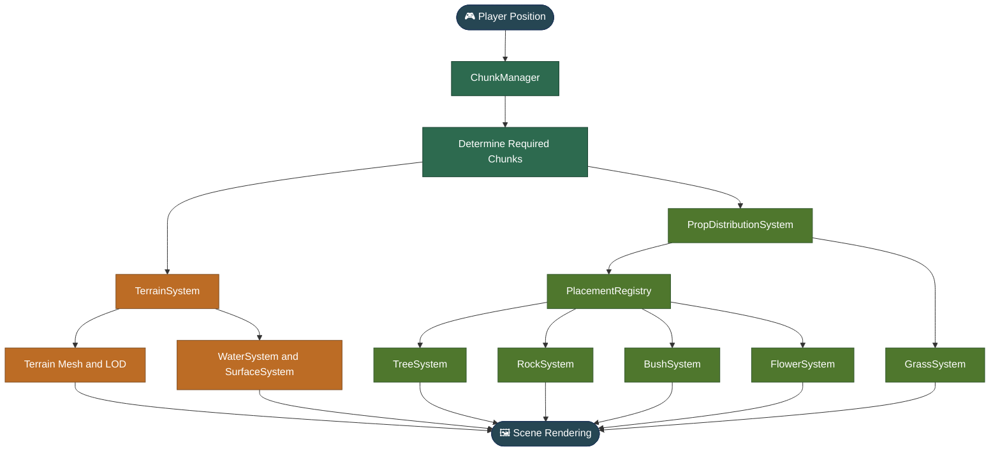
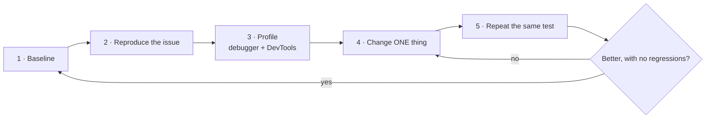

<div align="center">


<!-- SHOW: 8-12 second seamless loop. Walk through the meadow at golden hour: grass swaying, a short dash, fog softening the distance. -->

<br><br>

# 🌿 Project Whimsical

### *A stylized, procedural open-world adventure built with Three.js and WebGL*

*A cozy, stylized 3D RPG inspired by Studio Ghibli's art style and The Legend of Zelda.*

<br>


-BC6C25?style=flat-square)


<br>

<a href="#getting-started"><b>🚀 Getting Started</b></a> &nbsp;•&nbsp;
<a href="#features"><b>✨ Features</b></a> &nbsp;•&nbsp;
<a href="#controls"><b>🎮 Controls</b></a> &nbsp;•&nbsp;
<a href="#journey"><b>🧭 Dev Journey</b></a> &nbsp;•&nbsp;
<a href="#roadmap"><b>🗺️ Roadmap</b></a> &nbsp;•&nbsp;
<a href="#license"><b>📜 License</b></a>

</div>

<br>

> [!NOTE]
> **Project Whimsical is a work in progress.** Its current MVP focuses on exploration, gathering, and survival, with a larger procedural world and additional gameplay systems planned for the future.

Project Whimsical is a 3D RPG prototype built using HTML, CSS, JavaScript, and Three.js. The primary goal is to capture the whimsical, cozy atmosphere of Ghibli-inspired environments while exploring how far procedural generation, custom shaders, and performance-conscious rendering can take a browser-based 3D game.

The project started as an experiment in stylized 3D rendering and gradually evolved into a larger technical exploration involving procedural terrain, vegetation, dynamic lighting, custom movement, and world-generation systems. Many of its systems are still being actively developed and optimized.

---

<a id="features"></a>

## ✨ Features at a Glance

<table>
  <tr>
    <td align="center" width="33%">
      <h3>🌾 Procedural Grass</h3>
      <p>More than a million GPU-animated blades with noise-driven wind and bend-aware shading.</p>
    </td>
    <td align="center" width="33%">
      <h3>🌲 Living World Props</h3>
      <p>Trees, rocks, bushes and flowers placed by noise and seeded rules, with LOD, culling and instancing.</p>
    </td>
    <td align="center" width="33%">
      <h3>⛰️ Streaming Terrain</h3>
      <p>Chunked terrain generated in workers, with multi-resolution LOD and skirts that hide seams.</p>
    </td>
  </tr>
  <tr>
    <td align="center" width="33%">
      <h3>💧 Ghibli-style Water</h3>
      <p>Lakes with a custom shader ported from a Blender node graph: soft shores, foam and sparkles.</p>
    </td>
    <td align="center" width="33%">
      <h3>🏃 Fluid Movement</h3>
      <p>Momentum-based sprinting, dashing, double jump and dash-jump with camera feedback.</p>
    </td>
    <td align="center" width="33%">
      <h3>📊 Performance Tools</h3>
      <p>An in-game debugger plus a measure, change, re-measure workflow built on Chrome DevTools.</p>
    </td>
  </tr>
</table>

---

<a id="gallery"></a>

## 📸 Gallery

<table>
  <tr>
    <td width="33%"></td>
    <td width="33%"></td>
    <td width="33%"></td>
  </tr>
  <tr>
    <td align="center"><sub><b>Rolling meadows</b></sub></td>
    <td align="center"><sub><b>Light through the trees</b></sub></td>
    <td align="center"><sub><b>Lake shoreline</b></sub></td>
  </tr>
  <tr>
    <td width="33%"></td>
    <td width="33%"></td>
    <td width="33%"></td>
  </tr>
  <tr>
    <td align="center"><sub><b>Rocks and wildflowers</b></sub></td>
    <td align="center"><sub><b>Atmospheric depth</b></sub></td>
    <td align="center"><sub><b>Orbit camera view</b></sub></td>
  </tr>
</table>

<!-- SHOW (Gallery_01): wide shot of rolling grass, flowers in the foreground, hills fading into fog, golden-hour light. -->
<!-- SHOW (Gallery_02): trees with visible light shafts and the teal-to-green leaf gradient. -->
<!-- SHOW (Gallery_03): lake edge with pebble beach, foam line, water sparkles, grass beyond. -->
<!-- SHOW (Gallery_04): a rock cluster with flowers and bushes around it, shadows of trees on the grass. -->
<!-- SHOW (Gallery_05): a long view to the horizon. Use the 2 km build if possible, otherwise the farthest distance you have. -->
<!-- SHOW (Gallery_06): orbit camera high above, showing the variety of the landscape. -->

---

<details>
<summary><b>📑 Table of Contents</b></summary>

<br>

- [Project Overview](#overview)
- [Tech Stack](#tech-stack)
- [Controls](#controls)
- [Getting Started](#getting-started)
- [Development Journey](#journey)
- [Grass Rendering and Procedural Wind](#grass)
- [Shaders and Stylized Lighting](#shaders)
- [Noise and Procedural Generation](#noise)
- [Terrain Generation and Streaming](#terrain)
- [Procedural Vegetation and Prop Systems](#props)
- [World Generation and Chunk Management](#world)
- [Save System](#saves)
- [Movement System](#movement)
- [Performance Debugging and Optimization](#performance)
- [Future Roadmap](#roadmap)
- [Inspiration and References](#references)
- [Contributing](#contributing)
- [License and Asset Usage](#license)

</details>

---

<a id="overview"></a>

## 🌍 Project Overview

The current version is centered around a gather-and-survive gameplay loop, supported by a procedurally generated environment.

The larger vision is to build a world that feels alive through its terrain, vegetation, lighting, environmental details, and eventually its inhabitants.

### Current areas of development

| Rendering | World | Gameplay and tools |
|---|---|---|
| 🎨 Stylized 3D rendering with Three.js and custom shaders | 🏔️ Procedural terrain and chunk-based world management | 🏃 Custom first-person movement: sprint, dash, double jump |
| 🌾 Custom grass deformation, wind animation and color variation | 🌳 Procedural placement of trees, rocks, bushes, flowers and grass | 📊 Performance monitoring and debugging tools |
| 🔭 Terrain and prop Level of Detail (LOD) | ⚡ Instanced rendering and draw-call optimization | 🧪 Experimental procedural terrain and gesture-control prototypes |
| 👁️ Frustum and distance-based culling | | |

The emphasis is not just on creating a visually appealing environment, but on understanding the rendering and systems architecture required to make a large, stylized world practical in a browser.

---

<a id="tech-stack"></a>

## 🧰 Tech Stack

| Technology | Purpose |
|---|---|
|  | Game entry point and page structure |
|  | Interface and page styling |
|  | Gameplay, world systems, and application logic |
| [](https://threejs.org/) | 3D rendering, scene management, materials, and geometry |
| [](https://developer.mozilla.org/en-US/docs/Web/API/WebGL_API) | Browser-based GPU rendering |
|  | Grass animation, water, stylized rendering, and custom visual effects |
| [](https://vite.dev/) | Development server and production build tooling |
| [simplex-noise](https://www.npmjs.com/package/simplex-noise) | Procedural noise generation |
| [alea](https://www.npmjs.com/package/alea) | Seeded pseudo-random number generation |
| Web Workers | Background terrain generation and other background-processing workflows |
| IndexedDB, Web Storage, Cookies | Save system and player settings |
|  | Modeling, asset creation, mesh preparation, and LOD generation |
|  | Source control and large binary assets |

The project uses custom systems built on top of Three.js rather than relying entirely on ready-made environment-generation solutions.

---

<a id="controls"></a>

## 🎮 Controls

| Input | Action |
|---|---|
| <kbd>V</kbd> | Switch between the orbit camera and first-person mode |
| Click the game view | Capture the mouse (first-person mode) |
| <kbd>W</kbd> <kbd>A</kbd> <kbd>S</kbd> <kbd>D</kbd> | Move |
| <kbd>Shift</kbd> | Sprint |
| <kbd>Space</kbd> | Jump (press again in the air to double jump) |
| <kbd>C</kbd> | Dash (jump right after a dash for a boosted dash-jump) |
| <kbd>K</kbd> | Open the save menu |
| <kbd>F3</kbd> | Toggle the performance debugger |
| <kbd>F8</kbd> | Toggle the frustum visualization (debug) |
| Mouse drag and wheel | Orbit camera: rotate and zoom |

---

<a id="getting-started"></a>

## 🚀 Getting Started

### Prerequisites

- [Node.js](https://nodejs.org/) and npm.
- [Git](https://git-scm.com/) for cloning the repository.
- [Git LFS](https://git-lfs.com/) if the repository uses LFS to distribute its model assets.
- A modern browser with WebGL support.
- Visual Studio Code is recommended for development.

### Option 1: Clone the repository

```bash
git clone YOUR_REPOSITORY_URL
cd Project-Whimsical

git lfs install
git lfs pull

npm install
npm run dev
```

Replace `YOUR_REPOSITORY_URL` with the HTTPS URL of this repository, then open the local URL printed by Vite in your terminal.

> [!IMPORTANT]
> Git LFS can download the actual models only if their corresponding LFS objects have been uploaded successfully. If some models are unavailable, use the asset download instructions below.

<details>
<summary><b>Option 2: Download the repository as a ZIP</b></summary>

<br>

1. Open this repository on GitHub.
2. Select **Code → Download ZIP**.
3. Extract the archive.
4. Open the extracted project folder in Visual Studio Code.
5. Open a terminal in the folder containing `package.json`.
6. Install dependencies:

   ```bash
   npm install
   ```

7. Download the required model assets using the link below.
8. Extract the models into the expected directory.
9. Start the game:

   ```bash
   npm run dev
   ```

</details>

### 📦 Download the required 3D models

Some large 3D assets are distributed separately from the source repository.

**[⬇️ Download Project Whimsical 3D Models from Google Drive](https://drive.google.com/file/d/1Aes-bPFvX7LrCA7FTNOIsP8iJK4g1qXF/view?usp=sharing)**

After downloading, extract the archive and place the model files in:

```text
game/
└── models/
    ├── TreeMine.glb
    ├── rocks_LODS2.glb
    ├── bushes_gn_shader.glb
    └── ...
```

The filenames above are examples of required assets; preserve the complete set of files and directories provided in the archive. Make sure you have downloaded the actual model binaries, not Git LFS pointer files.

> [!WARNING]
> **Asset usage restriction:** The 3D models and other designated art assets are not licensed for commercial use without prior permission from their respective rights holders. See [License and Asset Usage](#license).

<details>
<summary><b>🛠️ Troubleshooting</b></summary>

<br>

**Models fail to load**

- Check that the required `.glb` files exist in `game/models/`.
- Confirm that the downloaded files are actual binary model files rather than LFS pointers.
- Check the browser console and network panel for failed asset requests.

**npm reports missing scripts**

Ensure you are using the project version containing the Vite configuration and `dev` script.

**Dependencies fail to resolve**

Run `npm install` from the directory containing `package.json`, rather than from inside `game/`.

**The game runs but some assets are missing**

Check the asset paths and ensure the complete model archive has been extracted into the expected directory.

</details>

---

<a id="journey"></a>

## 🧭 Development Journey

The game has developed incrementally through experiments with rendering, modeling, procedural generation, and performance optimization. The following steps document that progression.

<table>
  <tr>
    <td width="55%"></td>
    <td valign="top">
      <h3>1 · Initial Three.js Experiments</h3>
      <p>The earliest experiments focused on understanding Three.js rendering, model loading, animation mixers, and the fundamentals of building a 3D scene in the browser.</p>
      <p>This phase helped establish the foundation for loading animated models, controlling the scene, and experimenting with different visual styles.</p>
    </td>
  </tr>
  <tr>
    <td width="55%"></td>
    <td valign="top">
      <h3>2 · Modeling and Instancing</h3>
      <p>The next phase involved creating custom assets in Blender and testing how multiple copies of those assets could be rendered efficiently.</p>
      <p>Rather than treating every object as an independent rendering operation, the project began exploring instancing and more structured approaches to placing repeated environmental props.</p>
    </td>
  </tr>
  <tr>
    <td width="55%"></td>
    <td valign="top">
      <h3>3 · Environmental Scale, Lighting, and Fog</h3>
      <p>Large environmental props and statues helped establish a sense of scale. Lighting and fog were then refined to create atmospheric depth and move the environment closer to the intended cozy, stylized aesthetic.</p>
      <p>Fog also helps soften distant scenery and visually integrate objects into the environment.</p>
    </td>
  </tr>
  <tr>
    <td width="55%"></td>
    <td valign="top">
      <h3>4 · Grass Experiments</h3>
      <p>Grass became one of the most technically interesting parts of the project. The goal was to create vegetation that moved naturally and contributed to the atmosphere without making the rendering workload impractical.</p>
      <p>This led to experiments with custom shaders, procedural wind, deformation, color variation, and shadow behavior.</p>
    </td>
  </tr>
  <tr>
    <td width="55%"></td>
    <td valign="top">
      <h3>5 · Integrating the Environment</h3>
      <p>The later experiments focused on integrating the environment's models, terrain, vegetation, lighting, and rendering systems into a more cohesive world.</p>
    </td>
  </tr>
</table>

<!-- SHOW (DevJourney_01): your first animated model playing in a plain Three.js scene (the animation mixer test). -->
<!-- SHOW (DevJourney_02): the Blender viewport with a model, then the same model instanced many times in the browser. -->
<!-- SHOW (DevJourney_03): the large statues spawning with early lighting and fog. -->
<!-- SHOW (DevJourney_04): the earliest grass: rough blades swaying, before the color and shadow work. -->
<!-- SHOW (DevJourney_05): the first clip where terrain, grass, trees and lighting all work together. -->

<details>
<summary><b>🎞️ Full-length development videos</b></summary>

<br>

If you keep the original clips, add them here (GitHub plays `.mp4` files up to its upload limit; use YouTube links for larger ones):

- [▶ Animation mixer and rendering experiment](ForDocumentation/DevJourney_01_AnimationMixer.mp4)
- [▶ Blender modeling and instancing](ForDocumentation/DevJourney_02_Blender_Instancing.mp4)
- [▶ Statues, lighting and fog](ForDocumentation/DevJourney_03_Statues_Lighting_Fog.mp4)
- [▶ Early grass experiment](ForDocumentation/DevJourney_04_Early_Grass.mp4)
- [▶ Latest environment and final models](ForDocumentation/DevJourney_05_Integrated_World.mp4)

</details>

---

<a id="grass"></a>

## 🌾 Grass Rendering and Procedural Wind

<div align="center">
  
  <br><sub><b>GPU-driven wind: noise moves whole patches of blades, not each blade in sync</b></sub>
</div>

<!-- SHOW (Grass_01): low camera, 6-10 second loop of a grass field with wind moving across it in waves. -->

Grass is one of the central technical features of Project Whimsical.

Its visual direction was inspired in part by **rice fields**: dense, flowing vegetation that responds to wind and creates a sense of movement across the landscape. The challenge was to reproduce that feeling while keeping the number of rendered objects and the associated GPU workload under control.

### Why custom grass shaders?

A straightforward approach to grass would create many individual meshes and animate each object separately. That becomes expensive when vegetation covers a large area.

Instead, Project Whimsical uses a custom grass-rendering approach designed to support very large numbers of blades. The system has been tested with scenes containing more than one million grass blades, although actual performance depends on hardware, visible density, resolution, and other scene effects.

<div align="center">
  
  <br><sub><b>A scene with over a million blades, with the instance count and frame rate on screen</b></sub>
</div>

<!-- SHOW (Grass_06): a wide grass view with the FPS panel and the blade count visible (console log or debug overlay) as proof of the 1M+ claim. -->

### Wind animation

Rather than individually moving every blade through JavaScript, the grass shader calculates deformation on the GPU. Procedural variation, including noise-based motion, helps produce a less uniform result than having every blade bend in synchronization.

The intended effect is a field of grass that responds continuously to its environment instead of behaving like a collection of rigid, identical objects.

### Bending and lighting-aware color variation

An important visual detail is the relationship between blade deformation and color.

When a blade bends, its orientation changes. Its apparent brightness should change as well, because its surface is no longer oriented toward the light in the same way.

Using a full lighting calculation for every blade can be expensive at high densities. Instead, the grass shader incorporates a cheaper color adjustment associated with bending: **bent blades become darker**, helping suggest changes in illumination without the cost of a more elaborate lighting solution for every blade.

This is a deliberate balance between visual plausibility and performance.

### Shadow strategy

Grass is rendered **unlit**: scene lighting is ignored, and only shadows cast by environmental objects (trees, rocks, bushes) darken it, using a configurable shadow color. The grass itself casts no shadows.

This is both a performance consideration and a stylistic choice. Dense grass shadow maps become expensive, and an unlit look with soft object shadows helps preserve the intended visual treatment.

<table>
  <tr>
    <td width="33%"></td>
    <td width="33%"></td>
    <td width="33%"></td>
  </tr>
  <tr>
    <td align="center"><sub><b>Bent blades darken</b></sub></td>
    <td align="center"><sub><b>Object shadows on unlit grass</b></sub></td>
    <td align="center"><sub><b>Grass LOD tiers</b></sub></td>
  </tr>
</table>

<!-- SHOW (Grass_02): extreme close-up of blades mid-bend, tips darker where they lean. -->
<!-- SHOW (Grass_03): a tree's shadow falling across bright grass, light edge clearly visible. -->
<!-- SHOW (Grass_04): one screenshot split into three zones, or three side-by-side crops: detailed textured blades, wider medium planes, flat far planes. Label them (with the grass debug spheres on if you like). -->

### Grass optimization techniques

The grass system forms part of a wider optimization strategy:

- GPU-side deformation rather than individual JavaScript animation of every blade.
- Noise-driven movement to create variation.
- Shader-based color adjustments associated with bending.
- Selective shadow handling.
- Instancing and batched rendering where appropriate.
- **Distance tiers:** detailed blades nearby, simplified wider planes farther away, hidden beyond range.
- **Per-cell culling:** each chunk is split into cells with their own bounding volumes, so off-screen grass is skipped.
- Avoiding unnecessary per-blade CPU work and draw calls.

These techniques are intended to make dense vegetation practical while retaining the visual qualities that motivated the system.

### Grass references

| | |
|---|---|
| [▶ **SimonDev: Procedural Grass**](https://www.youtube.com/watch?v=bp7REZBV4P4) | A particularly valuable resource throughout development for procedural grass, shader-based animation, and performance-conscious rendering. |
| [🎤 **GDC Advanced Graphics Summit: Procedural Grass**](https://gdcvault.com/play/1027214/Advanced-Graphics-Summit-Procedural-Grass) | Insight into the challenges of rendering dense grass in a real-time game. |

<div align="center">
  
  <br><sub><b>The inspiration: wind rolling across a rice field</b></sub>
</div>

<!-- SHOW (Grass_05): a short clip or photo of a real rice field in wind. Only use footage you filmed or that is licensed for reuse. -->

---

<a id="shaders"></a>

## 🎨 Shaders and Stylized Lighting

Custom shaders are used where the standard rendering pipeline does not provide the desired visual effect or where a specialized GPU-side implementation is more practical.

The intention is not to replace every built-in Three.js feature, but to use custom shader logic where it offers a clear visual or performance benefit.

### Grass shader

The grass shader handles procedural bending, wind-driven motion, and color adjustments associated with deformation. It is designed to support high vegetation density without requiring a separate JavaScript animation loop for each blade.

### God rays

The project also contains a `godRaysShader` experiment for stylized shafts of light. This effect helps convey light passing through the environment, particularly around trees and their surrounding foliage.

The objective is to enhance atmosphere and make lighting an active part of the scene's composition rather than merely illuminating the models.

<div align="center">
  
  <br><sub><b>God rays streaming through the foliage</b></sub>
</div>

<!-- SHOW (Shader_01): a tree with the sun behind or beside it so visible light shafts radiate through the leaves. -->

### Ghibli-style water

Lakes use a custom water shader ported from a Blender node graph. A depth-driven color ramp gives light shallows and deep blue centers, fBM noise is screen-blended into the base color, and streaky sparkle highlights come from stretched noise combined with animated Voronoi dots. Shorelines fade softly, with optional foam.

Water meshes are only built where terrain dips below sea level, so most chunks pay nothing for water. Sea level is derived from the world's own height distribution.

<table>
  <tr>
    <td width="50%"></td>
    <td width="50%"></td>
  </tr>
  <tr>
    <td align="center"><sub><b>In game: sparkles, ripples and a soft shoreline</b></sub></td>
    <td align="center"><sub><b>Blender prototype vs the in-game port</b></sub></td>
  </tr>
</table>

<!-- SHOW (Shader_03): 5-8 second loop of a lake from the shore, sparkles twinkling, foam line at the edge. -->
<!-- SHOW (Shader_04): left = the Blender material preview of the water, right = the same look in game (optionally with the node graph screenshot below it). -->

### Stylized lighting and fog

Lighting and fog contribute significantly to the intended Ghibli-inspired atmosphere. The environment has been developed through iterative adjustments to lighting, fog density, material response, and scene composition.

These choices are intended to make the world feel cohesive rather than simply combining realistic models with a stylized color palette.

<div align="center">
  
  <br><sub><b>Fog off vs fog on: depth and atmosphere</b></sub>
</div>

<!-- SHOW (Shader_02): the same camera position twice, side by side: left with fog disabled (hard horizon), right with fog enabled (layered depth). -->

---

<a id="noise"></a>

## 🌊 Noise and Procedural Generation

Noise is used throughout the project, not just for grass animation. The project uses Perlin-style and Simplex noise techniques to introduce structured variation into procedural systems.

Noise provides a way to generate values that vary smoothly across space. This is useful when random placement alone would produce an environment that feels too uniform or visually chaotic. Seeded pseudo-random number generation complements noise by making many procedural decisions reproducible.

### Where noise is used

| System | Role of noise |
|---|---|
| `TerrainSystem` | Terrain height variation and the generation of natural-looking landscapes. |
| `PropDistributionSystem` | Noise and seeded randomness distribute environmental objects with variation, rather than placing them in perfectly regular patterns. |
| `WaterSystem` | Ripple, color and sparkle patterns in the water shader. |
| `SurfaceSystem` | Surface variation that helps distinguish different areas of the environment. |
| `WorldGenerator` | Noise and procedural generation contribute to the broader process of building a varied world from reusable rules. |

The exact role of each noise function depends on the system using it. Noise is a building block rather than a complete world-generation algorithm: it must be combined with placement rules, terrain constraints, and other systems to create a convincing environment.

<div align="center">
  
  <br><sub><b>Density maps: grass, trees, rocks and flowers each get their own noise field</b></sub>
</div>

<!-- SHOW (Noise_01): a 2x2 or 1x4 grid of the density maps (use generatePropDistributionMap) for grass, tree, rock, flower. Label each. -->

<div align="center">
  
  <br><sub><b>Height map, surface map (grass, dirt, gravel, rock), and the resulting terrain</b></sub>
</div>

<!-- SHOW (Noise_02): three panels: generateDisplacementMap output, generateSurfaceMap output, and a screenshot of the same chunk rendered. -->

---

<a id="terrain"></a>

## ⛰️ Terrain Generation and Streaming

A procedural world needs more than a terrain-height function. It also needs a way to create, display, and unload terrain as the player moves through the environment.

Project Whimsical uses a chunk-based terrain architecture to organize the world into manageable regions.

<div align="center">
  
  <br><sub><b>Chunks streaming in and out as the player explores</b></sub>
</div>

<!-- SHOW (Terrain_01): orbit camera high up, flying forward so new chunks appear at the edge and old ones disappear behind. Wireframe on if you can. -->

### Chunk-based terrain

Instead of treating the entire world as one enormous mesh, terrain is divided into chunks. This provides a foundation for:

- Generating terrain locally.
- Managing which regions are loaded.
- Applying different levels of detail at different distances.
- Spawning environmental objects in the appropriate regions.
- Unloading distant regions when they are no longer needed.

### Terrain detail and LOD

Terrain detail is expensive when every region uses maximum resolution regardless of its distance from the player.

The terrain system therefore uses a distance-aware approach with multiple terrain resolutions. Nearby terrain can use finer detail, while more distant terrain can use coarser geometry. The objective is to preserve detail where it matters most while controlling the amount of geometry that must be generated and rendered.

<table>
  <tr>
    <td width="50%"></td>
    <td width="50%"></td>
  </tr>
  <tr>
    <td align="center"><sub><b>Three terrain resolutions in wireframe</b></sub></td>
    <td align="center"><sub><b>Surface types blended by slope and noise</b></sub></td>
  </tr>
</table>

<!-- SHOW (Terrain_02): top-down wireframe: dense triangles near the player, coarser rings further out. -->
<!-- SHOW (Terrain_03): terrain with grass, bare dirt patches, gravel and steep rock faces clearly visible (vegetation off helps). -->

### Faster terrain appearance

A major area of experimentation has been making terrain appear quickly as the player explores.

The architecture separates terrain creation from the broader process of managing the world. Worker-based processing is used for terrain generation, with the aim of moving suitable calculations away from the main rendering thread.

The intended benefits include:

- Reducing expensive synchronous work on the main thread.
- Generating terrain in manageable chunks.
- Supporting multiple terrain resolutions.
- Improving how new regions become available during exploration.

> [!TIP]
> Worker-based generation does not eliminate all stalls by itself. Geometry creation, uploads, mesh construction, and other main-thread operations must still be managed carefully.

### Experimental quad-tree terrain

A far-terrain **quad-tree** is being developed in a separate version of the project, aiming at a view range approaching **2 km**. Terrain nodes double in size with distance (64, 128, 256, 512, 1024 units), so the vertex count per node stays constant while the visible distance grows. An earlier experiment is available in `TerrainGenBackUp/`. It is not yet the finalized terrain architecture.

<div align="center">
  
  <br><sub><b>Experimental quad-tree: small cells near the player, huge cells at the horizon</b></sub>
</div>

<!-- SHOW (Terrain_04): wireframe view from a hill: fine cells close up growing to very large cells at the horizon. Use farTerrain.setWireframe(true). -->

---

<a id="props"></a>

## 🌲 Procedural Vegetation and Prop Systems

A procedural environment needs a variety of objects to avoid looking repetitive.

Project Whimsical separates the placement and management of environmental objects into specialized systems. This makes it possible to develop different object types without putting every placement rule into one enormous world-generation function.

<table>
  <tr>
    <td width="33%"></td>
    <td width="33%"></td>
    <td width="33%"></td>
  </tr>
  <tr>
    <td align="center"><sub><b>Trees (Blender)</b></sub></td>
    <td align="center"><sub><b>Rock variations and LODs</b></sub></td>
    <td align="center"><sub><b>Bushes and flowers in game</b></sub></td>
  </tr>
</table>

<!-- SHOW (Props_01): Blender viewport with the tree models lined up, ideally with the leaf shader preview. -->
<!-- SHOW (Props_02): the rock variations in a row, with the LOD levels of one rock shown with triangle counts. -->
<!-- SHOW (Props_03): in-game close view of bushes and flower clusters on the grass. -->

| System | Responsibility |
|---|---|
| `TreeSystem` | Tree models, placement, and tree-specific rendering behavior |
| `RockSystem` | Rock models, placement, and LOD variants |
| `BushSystem` | Bush placement and rendering |
| `FlowerSystem` | Flower placement and rendering |
| `GrassSystem` | Dense grass generation, animation, and rendering |
| `PropDistributionSystem` | Procedural distribution of environmental props |
| `PlacementRegistry` | Tracks placements and supports spatial checks between systems |

These systems work together to create a varied environment while respecting placement constraints and rendering budgets.

### Leaf shader and moving shadows

Tree foliage uses a custom leaf shader with a stylized gradient and wind sway. The shadow pass uses the same wind, so shadows move with the leaves instead of staying frozen.

<div align="center">
  
  <br><sub><b>Leaves and their shadows sway together</b></sub>
</div>

<!-- SHOW (Props_05): a tree in wind with its shadow visible on the ground, so the shadow clearly moves with the leaves. -->

### PlacementRegistry

Procedural placement must account for more than randomness. Trees, rocks, bushes, flowers, and other objects should not overlap arbitrarily or occupy locations that violate the intended placement rules.

The `PlacementRegistry` provides a shared mechanism for tracking placements and checking whether a proposed location is blocked. This allows different systems to coordinate their placement decisions rather than each system making decisions in complete isolation.

It also introduces its own performance considerations. Repeated spatial checks and unnecessary allocations can become expensive when many objects are generated, so the registry and its callers are important optimization targets.

<div align="center">
  
  <br><sub><b>Footprints registered by trees and rocks keep grass and other props out</b></sub>
</div>

<!-- SHOW (Props_04, optional): top-down debug view with circles drawn at each registered footprint (trees, rocks, bushes) and grass cleared inside them. -->

### Level of Detail

Level of Detail, or LOD, reduces the complexity of objects as their distance from the player increases.

A distant tree or rock generally does not need the same geometry and material complexity as an object directly in front of the camera. The project experiments with object-specific LOD approaches, including simplified meshes and alternative representations at greater distances.

The precise implementation differs between systems. The goal is to preserve the overall silhouette and appearance of the environment while avoiding unnecessary detail on distant objects.

### Shader application conditions

Custom materials and shaders can provide attractive results, but they may also introduce additional rendering work.

Where possible, shader effects should be applied only when they are needed. Distant or simplified objects may use cheaper materials or omit expensive effects, depending on the system. This makes visual quality a distance-aware decision rather than an all-or-nothing setting.

### Instancing and batching

Repeated objects are common in a natural environment. Trees, rocks, grass, and flowers may appear many times across the same region.

Instancing allows compatible objects to share geometry and material resources while varying their transforms and other supported attributes. Batching can also reduce the number of individual draw calls where objects can be grouped appropriately.

These techniques are especially valuable when a scene contains many repeated objects, although they require careful handling of materials, visibility, and object-specific effects.

### Culling

Not every object in the world needs to be rendered on every frame. Project Whimsical uses visibility and distance-management techniques to reduce unnecessary work.

| Technique | What it does |
|---|---|
| **Frustum culling** | Avoids rendering objects outside the camera's view when supported by the relevant rendering path. |
| **Distance-based culling** | Removes or suppresses objects that are too far away to justify their rendering cost. |
| **Chunk-based management** | Organizes objects around loaded world regions. |
| **LOD switching** | Reduces complexity for objects that remain visible at greater distances. |

Culling complements LOD: one determines whether an object needs to be rendered at all, while the other determines how much detail it should use when it is rendered.

<details>
<summary><b>🔧 Other optimization considerations</b></summary>

<br>

- Reducing unnecessary draw calls.
- Reusing geometry and materials where possible.
- Avoiding redundant shader work.
- Minimizing allocations during procedural generation.
- Reducing repeated spatial lookups.
- Managing chunk creation and disposal.
- Separating generation logic from rendering where appropriate.
- Avoiding unnecessary processing for distant or inactive objects.

No single technique solves every performance problem. The goal is to make each subsystem efficient enough to contribute to the larger world without dominating the frame time.

</details>

---

<a id="world"></a>

## 🗺️ World Generation and Chunk Management

The environment is the result of multiple specialized systems working together, rather than a single function that creates everything. At a high level, the process is organized around terrain generation, procedural placement, rendering decisions, and chunk management.

### ChunkManager

The `ChunkManager` coordinates which terrain chunks are active around the player. It tracks loaded chunks, determines which regions should be present based on the player's position and the configured loading range, and manages the creation and removal of chunk-related resources. Each chunk can contain terrain and associated environmental systems.

### How the systems fit together



This is a conceptual overview of the system relationships, not a complete representation of every dependency or call sequence.

The important idea is that chunk management coordinates the environment, while specialized systems remain responsible for their own generation and rendering behavior. As the player moves, the world manager updates the required regions, and the associated systems supply the terrain and props needed to represent those regions.

This separation makes it easier to experiment with terrain generation, vegetation, LOD, and optimization without rewriting the entire world pipeline.

---

<a id="saves"></a>

## 💾 Save System

Progress is stored in the browser, with no account or server required. A save is a small record (name, world seed, player position and look direction, play time). Because the world is generated from the seed, terrain and props never need to be stored.

Press <kbd>K</kbd> in game to open the save menu.

| Operation | In the game | Storage |
|---|---|---|
| **Create** | *New world* (name and seed), *Save current game as new* | IndexedDB `add` |
| **Read** | Save list, *Load*, continue the last save on startup | IndexedDB `get` / `getAll` |
| **Update** | *Overwrite*, *Rename*, autosave every minute | IndexedDB `put` |
| **Delete** | *Delete* with confirmation | IndexedDB `delete` |

Other browser storage has small jobs of its own: **localStorage** keeps player settings, **sessionStorage** hands the chosen save over when the page reloads into it, and a **cookie** remembers the last save used.

<div align="center">
  
  <br><sub><b>The save menu: create, load, overwrite, rename and delete</b></sub>
</div>

<!-- SHOW (Save_01): the K menu open over the game with 3-4 saves in the list (different names and seeds), one marked "(current)". -->

---

<a id="movement"></a>

## 🏃 Movement System

Movement is another area where the project has evolved beyond a basic first-person controller. The goal is to make traversal feel responsive and expressive while remaining compatible with the terrain and environment.

### Current movement features

- Walking and directional movement.
- Sprinting.
- Dashing.
- Jumping and double jumping.
- Airborne dash experimentation (dash-jump).
- Gravity and terrain-height interaction.
- Camera movement and motion feedback.

The controller also explores presentation details such as walking and sprinting bob, jump anticipation, and dash lean.

<table>
  <tr>
    <td width="50%"></td>
    <td width="50%"></td>
  </tr>
  <tr>
    <td align="center"><sub><b>Sprint, dash and camera lean</b></sub></td>
    <td align="center"><sub><b>Double jump and dash-jump</b></sub></td>
  </tr>
</table>

<!-- SHOW (Movement_01): first-person: walk, sprint (camera bob), then a dash with the lean and FOV feel. 5-8 seconds. -->
<!-- SHOW (Movement_02): first-person: jump, double jump, then a dash immediately followed by a jump (dash-jump) over a hill. Show the capsule debug if you like. -->

### Inspiration

The movement direction draws inspiration from the fluidity and responsiveness of movement systems found in games such as Cyberpunk 2077.

The aim is to make traversal feel more expressive than simply moving a camera through a scene. Sprinting, jumping, and dashing should work together as parts of a coherent movement system. These features are still being refined, and the final movement model may change as the game's scale and gameplay requirements evolve.

---

<a id="performance"></a>

## 📊 Performance Debugging and Optimization

Performance is a recurring concern because the game combines dense vegetation, procedural geometry, custom shaders, terrain streaming, and large numbers of environmental props.

Rather than relying solely on how the game feels while running, the project includes a performance-debugging workflow to help identify expensive systems.

### Performance Debugger

The project's Performance Debugger (<kbd>F3</kbd>) is used to inspect the state of the environment and investigate performance bottlenecks. Depending on the active instrumentation, it can help examine:

- Frame rate and frame-time behavior.
- Draw calls and rendering workload.
- Loaded chunks and world activity.
- Prop counts and system-level behavior.
- Visibility and object distribution.
- The effects of enabling or disabling individual systems.
- The impact of despawning specific prop types during experiments.
- Diagnostic logs that can be reviewed after a test.

The ability to despawn props selectively is particularly useful: it helps isolate whether a performance problem is associated with a particular category of objects rather than the environment as a whole.

<table>
  <tr>
    <td width="50%"></td>
    <td width="50%"></td>
  </tr>
  <tr>
    <td align="center"><sub><b>The in-game debugger (F3)</b></sub></td>
    <td align="center"><sub><b>Isolating cost by despawning prop types</b></sub></td>
  </tr>
</table>

<!-- SHOW (Perf_01): the F3 panel open over the game with frame time, draw calls and triangles visible. -->
<!-- SHOW (Perf_03): screen recording of toggling grass, trees, rocks, flowers, bushes off one at a time while the triangle count visibly drops. -->

### Browser profiling

The built-in Google Chrome DevTools Performance panel is another important part of the workflow. It can help identify:

- Long-running JavaScript tasks.
- Main-thread stalls.
- Expensive function calls.
- Garbage-collection activity.
- Frame-time spikes.
- Work associated with rendering and procedural generation.

Combining game-specific instrumentation with browser profiling makes it easier to distinguish CPU-side bottlenecks from GPU or rendering-related costs.

<div align="center">
  
  <br><sub><b>Chrome DevTools: the same test before and after an optimization</b></sub>
</div>

<!-- SHOW (Perf_02): two DevTools Performance screenshots stacked: before (long function bars or frame spikes) and after the fix. Label them. -->

### The optimization workflow



This is particularly important for procedural worlds because an optimization that helps one system may introduce costs elsewhere. The long-term objective is to build a world that remains responsive as terrain, vegetation, and environmental complexity increase.

---

<a id="roadmap"></a>

## 🗺️ Future Roadmap

The following roadmap distinguishes existing work from ideas that are still experimental or conceptual. These are intended directions, not promises about release dates.

| | Item | Status | Notes |
|---|---|---|---|
| ⛰️ | **Quad-tree terrain system** | 🧪 Experimental | Adaptive subdivision with a long-term target approaching 2 km. Early work in `TerrainGenBackUp/`. |
| 💧 | **Water streams** | 💡 Concept | Procedural streams connecting to larger water basins. The basins are already implemented. |
| 🛤️ | **Procedural paths** | 💡 Concept | Paths that guide players toward points of interest. |
| 🦊 | **Procedural mobs** | 🔜 Not started | Procedurally generated or distributed creatures and other inhabitants. |
| 📖 | **Procedural narrative** | 💭 Undecided | Environmental stories, events, or other narrative elements. |
| ⚔️ | **Combat system** | 🔜 Planned | Design and implementation. |
| 🎒 | **Inventory system** | 🔜 Planned | Item collection and inventory management. |
| 💰 | **Economy** | 🔜 Planned | The world's economy and resource interactions. |
| 🏕️ | **Gathering and survival** | 🚧 MVP in progress | Expanding the MVP into a fuller gather-and-survive loop. |
| ✋ | **Gesture-based controls** | ✅ Prototype | Evaluate whether it fits the final game. Prototype in `gesture-controls/`. |

<div align="center">
  
  <br><sub><b>Gesture prototype: snap fingers for a light ball, open your palm for a fireball</b></sub>
</div>

<!-- SHOW (Roadmap_01): webcam view of the gesture prototype: finger snap spawns the light ball, open palm launches the fireball. -->

### Rendering and optimization

- [ ] Continue improving terrain streaming and chunk transitions.
- [ ] Refine LOD selection and object visibility management.
- [ ] Improve vegetation density and rendering efficiency.
- [ ] Continue profiling CPU and GPU workloads as the world becomes more complex.
- [ ] Refine atmospheric effects and stylized lighting.
- [ ] Improve the integration between world generation, movement, and gameplay.

---

<a id="references"></a>

## 🌟 Inspiration and References

### Visual inspiration

| | |
|---|---|
| 🎞️ **Studio Ghibli** | The cozy atmosphere, natural environments, expressive lighting, and sense of wonder found in Ghibli-inspired worlds. |
| 🗡️ **The Legend of Zelda** | The sense of adventure and exploration associated with stylized fantasy environments. |

These are sources of inspiration rather than claims of affiliation or endorsement.

### Technical references

| Reference | Why it mattered |
|---|---|
| [▶ **SimonDev: Procedural Grass** (YouTube)](https://www.youtube.com/watch?v=bp7REZBV4P4) | A particularly valuable resource throughout the grass-rendering and shader-development process. |
| [🎤 **GDC Advanced Graphics Summit: Procedural Grass**](https://gdcvault.com/play/1027214/Advanced-Graphics-Summit-Procedural-Grass) | A technical reference for the challenges of rendering dense procedural vegetation in real-time environments. |

These resources helped inform the project's exploration of GPU-side animation, vegetation rendering, and the trade-offs involved in producing detailed environments efficiently.

---

<a id="contributing"></a>

## 🤝 Contributing

Project Whimsical is an ongoing learning and development project. If you are interested in procedural generation, Three.js, shader programming, terrain systems, stylized rendering, or game optimization, contributions and constructive feedback are welcome.

Before proposing large architectural changes, please consider the existing systems and their interactions. The project is built around specialized terrain, placement, vegetation, movement, and chunk-management components, and preserving those boundaries is important.

For changes involving performance, measurements and reproducible test cases are especially helpful.

### Suggested contribution workflow

1. **Fork** the repository.
2. **Create a branch** for your changes.
3. Make **focused changes** that preserve existing system responsibilities.
4. **Test** the game and inspect the browser console.
5. **Profile** performance-sensitive changes where appropriate.
6. **Submit a pull request** describing the change and its impact.

---

<a id="license"></a>

## 📜 License and Asset Usage

### Source code

The project's source code is intended to be released under the **MIT License**, subject to the terms in the repository's `LICENSE` file. The MIT License permits broad use of covered code, including commercial use, subject to its conditions.

### 3D models and other art assets

> [!CAUTION]
> **The project's 3D models and designated art assets are not automatically covered by the source-code license.**
>
> Unless otherwise stated or separately authorized, the models distributed through the external asset download are **not licensed for commercial use**. Please obtain prior permission from the relevant rights holder before using them in a commercial project.

Do not assume that permission to use the source code grants permission to redistribute, sell, modify for commercial use, or incorporate the artwork into a commercial product.

For clarity, the repository should include a separate `ASSETS-LICENSE.md` identifying the assets covered by these restrictions. The README and asset archive should also clearly identify the applicable terms.

Third-party libraries, references, and assets remain subject to their own respective licenses and terms.

If you are interested in using an asset commercially, please contact the project maintainer to discuss permission.

---

<div align="center">

**🌿 Project Whimsical** is a work in progress. The systems, visuals, architecture, and roadmap described here may change as development continues.

<sub>Built with Three.js, a lot of noise functions, and a love for cozy worlds.</sub>

<a href="#top"><b>⬆ Back to top</b></a>

</div>